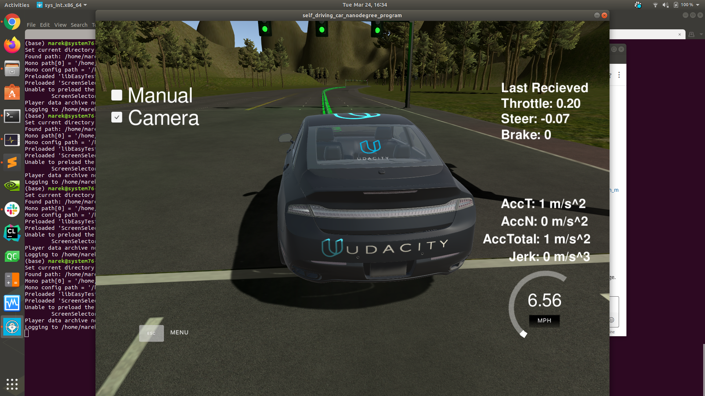
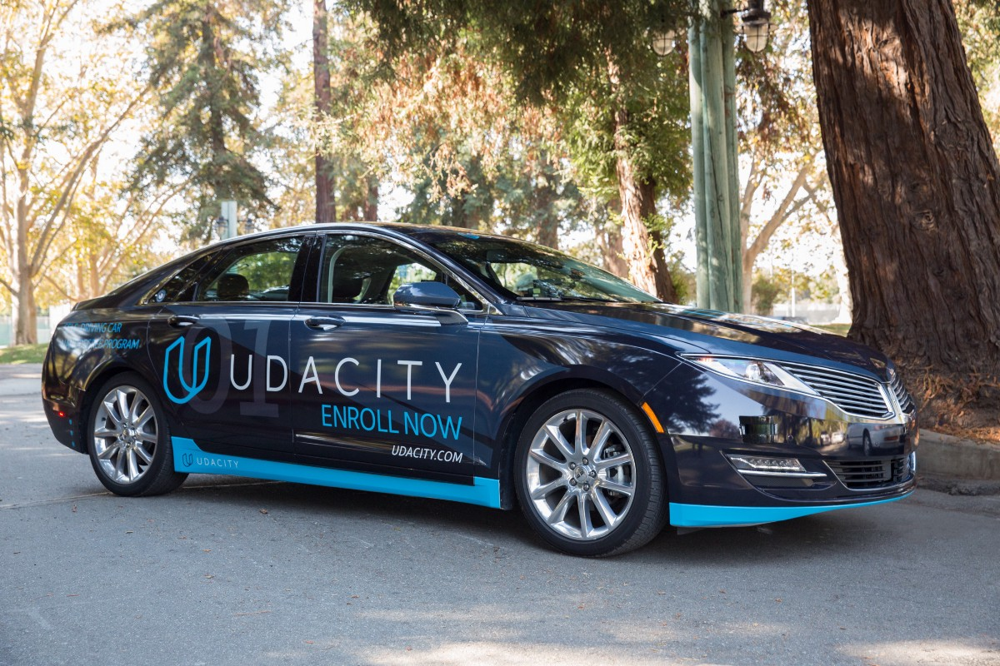
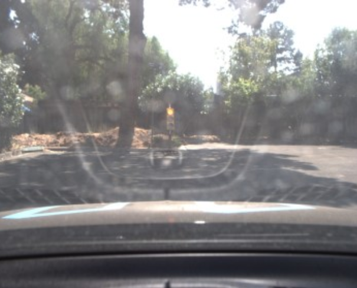
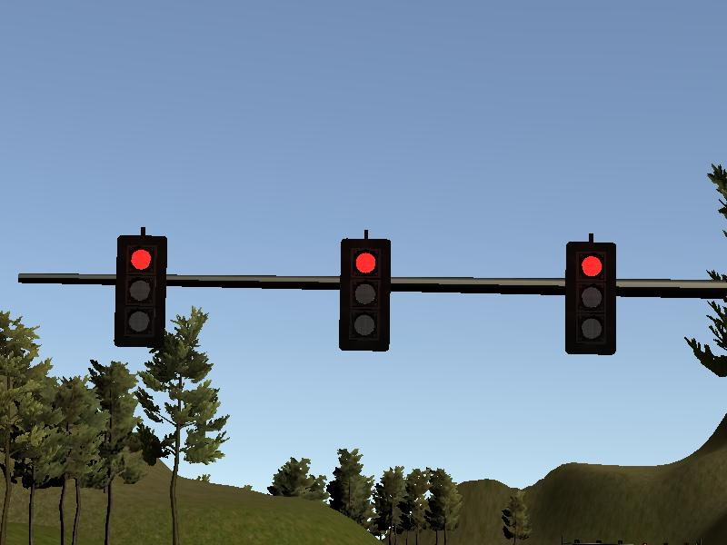
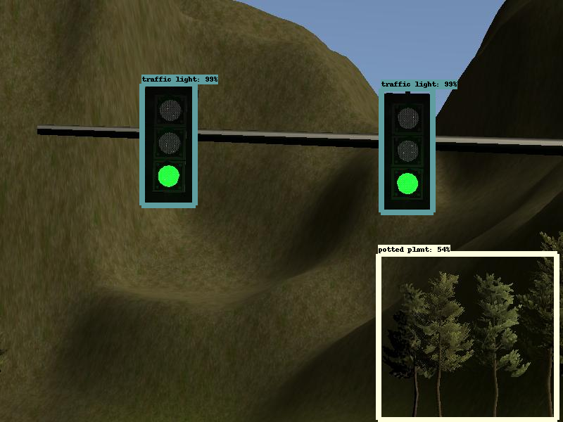
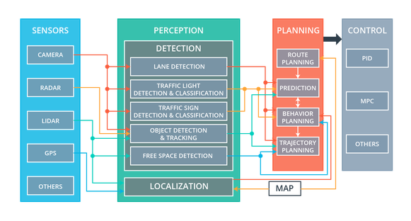
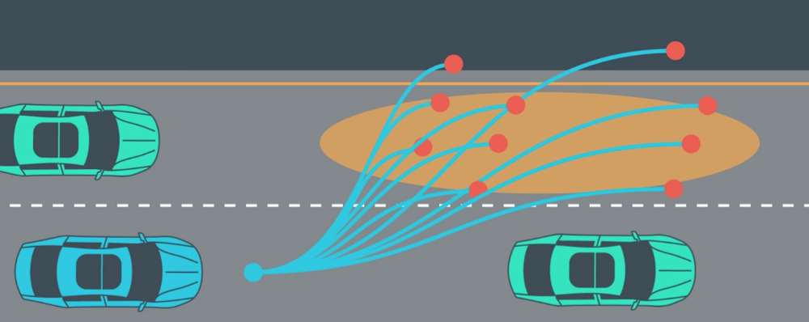

# Self-driving Car Engineer Nanodegree Capstone Project:  Program an Autonomous Vehicle

*Marek Kolodziej, Ph.D. Tim Limyl, M.S., Alejandro Terrazas, Ph.D., Jianzhou Zhao, M.S.*

The purpose of this capstone project is to combine the skills garnered by the students in Udacity Self-driving Car Engineering Nanodegree in order to program Udacity’s Carla self-driving car platform.  The students combined skills in computer vision, vehicle control systems, and integration through the Robot Operating System (ROS; <https://www.ros.org>).

## Project Aims

The project’s aims were scaled down from a full self-driving car application and, instead focused on __1)__ staying in a single lane and __2)__ stopping at red traffic lights.  Goals such as changing lanes, planning optimal routes, and reacting to traffic were not included in this project; although these were covered in other projects during the Nanodegree program.

## Project Stages

The project proceeded in two stages.  First, basic elements of the system were developed to run on Udacity’s simulator (***Figure 1***).  The simulator is a virtual reality 3D environment with three lanes of traffic and eight lights.  There are no other cars in the environment.  In order to pass the first test, the simulated vehicle must stop “safely”, that is smoothly and before the white line, at each red light, decide to stop or continue through each yellow light, and continue through each green light at an appropriate speed.  

***Figure 1 Simulator showing car at the starting position.*** *Manual mode allows the operator to use cursor controls and the mouse to drive the car; otherwise, the car is under control of the waypoint generator (see below).  By clicking the camera box, the user is able to see the view from the simlated car's camera.  The simulator software is developed in Unity 3D.  There are eight different lights situated around the circuitous track.*   

Once the software system passes the first test on the simulator, it is transferred to Udacity’s Carla (***Figure 2***) to run on a real-world (albeit greatly simplified) track.  The traffic lights encountered on the test track are substantially different than the traffic lights encountered in the simulator.  Moreover, conditions on the test track include glare and poor contrast among other challenges.   

***Figure 2 Carla. Udacity's Self-driving Car Platform.*** *Carla is a fully equiped self-driving car with sensors, perception modules, a planning system and controls.  Once students can pass the simulator test, they are able to run their software on Carla.*

## Object Detection and Classification System

In order to react correctly to the traffic lights, the software system must achieve __1) detection.__ Identify the traffic light housing with a bounding box and __2)__ Classification.__ Look within the bounding box to determine the state of the light (green, yellow, red).  A single shot detector (SSD; Liu et al. 2016 <https://arxiv.org/abs/1512.02325>) was used for this purpose.

***Figure 3: The SSD neural network architecture.***

The SSD used in this project took advantage of ***transfer learning*** in which a pretrained network is adapted for use in a specific project. The pretrained network selected was from the TensorFlow Zoo, which is a collection of detection models pre-trained on massive datasets. (<https://github.com/tensorflow/models/blob/master/research/object_detection/g3doc/detection_model_zoo.md>). 

Since the automotive hardware is closer to mobile or embedded devices than cloud GPUs, the MobileNet neural network designed for running very efficiently (high FPS, low memory footprint) on mobile devices, is integrated as the base network instead of VGG-16 shown in ***Figure 3***. The MobileNet can reduce the size of cummulative parameters and therefore the computation required on automotive/ mobile hardwares with limited resources (Andrew et al. 2017 <https://arxiv.org/abs/1704.04861>).

As already noted, the virtual camera and the real-world were substantially different (***Figure 4***) The virtual camera on the simulator produces 800 x 600 pixel (height by width) tri-color (blue, green red) images. These images were captured to disk for use in training and testing the computer vision module. In order to address the differences between the simulator and the real-world test track images, a mixture of real and simulator images were used for training, validation, and testing of the computer vision algorithms. Early development of the computer vision system relied on simulation images only. Following success with the simulator testing, additional images from the Bosch Small Traffic Light Dataset <https://hci.iwr.uni-heidelberg.de/node/6132> were mixed in.

<table><tr>
<td>  </td>
<td>  </td>
</tr></table>  ***Figure 4: Traffic light images from Carla (left) and the Udacity simulator (right).***  *Significant differences can be seen between the two images.  In the Carla real-world image, there is significant reflection from the dash upon the windshield that is not present in the simulator image.  Moreover, the simulator traffic lights are always of the overhead variety and come in groups of three housings, while the Carla image contains a single housing mounted on a post.  The sizes of the images are also different.  The differences between the simulator and Carla images make it necessary to train the light detection and classification module using a mixture of real world and simulator images.* 

The goal of object detection is to place a bounding box around the object of interest.  ***Figure 5*** below, shows an example image with bounding boxes around detected objects.

 ***Figure 5, Example image showing bounding boxes surrounding detected objects.***  *The image demonstrates correct detection of two traffic light housing and one incorrect detection of trees.  The second stage of the detection and classification is to determine whether the lights are green, yellow, or red.. Moreover, it is necessary to eliminate the false positive (lower right corner) surrounding the trees.  The false positive can be eliminated based on the shape of the bounding box because traffic lights are distinctively shaped as vertically oriented rectangles, while, the false positive is more square in shape. As shown in* ***Figure 4***, *above, the simulator does not contain overhead lights; therefore, looking in the upper part of the image would not work well for the Carla images.*

## Performance of the Traffic Light Detection and Classification System

The performance of the detection and classification system was measured separately.  For detection, the goal is to find correct bounding boxes, with a criterion of mean average precision (mAP; reviewed in <https://towardsdatascience.com/breaking-down-mean-average-precision-map-ae462f623a52>). In order to characterize the performance of the detection and classification system, the following metrics were used: __1)__ precision, and __2)__ recall. Chance performance for traffic lights is 33%.   

The object detection and classification software was written in Python 3.7 and TensorFlow version 1.3/ 1.15.

## Carla

Udacity’s Carla contains subsystems for __1)__sensing, __2)__ perception, __3)__ planning and __4)__ control.  These subsystems are described below.  Figure 5, shows an overview of Carla's subsystems. 

 
***Figure 6.  Architecture of Carla, the Udacity Self-driving Car.*** *The four modules work independently but exchange data via robot operating system (ROS) nodes (see description of ROS under ***Software Used*** below.* Image borrowed from Udacity Self-driving Car Nanodegree course materials.

***Sensing.*** The sensing subsystem is comprised of several cameras, an inertial measurement unit (IMU), and RADAR and LIDAR sensors.  The camera producing the images provided for this project are mounted behind the windshield (see ***Figure 4 (left)***, above).  Not included in this project (but part of Carla) are a RADAR sensor and a LIDAR sensor both of which provide the distance to nearby objects. The RADAR is forward facing and only senses the distance to objects in front of the car.  The LIDAR system has a 360-degree view that provides distance to objects in all directions. The GPS provides an estimate of position in global coordinates with 1-2 meters resolution. The IMU estimates displacement of the car in the x (forward-backward), y (left-right) and z (up-down) directions, along with the angular displacement.  

None of the individual sensors are sufficient for localizing the car to the degree needed for safe driving.  Therefore, sensor fusion (combining sensor data) is necessary. GPS coordinates for the lights and car location are provided in the simulator and on the test track; therefore, it is possible to anticipate upcoming lights.

***Perception.***  As in neural and cognitive science, perception differs from sensation in that the perception takes the raw input from the sensor and elaborates it into meaningful information.  Meaningful information for a car include traffic light detection and classification (as included in this project), obstacle detection, traffic sign detection, detection of other cars, and, pedestrians.  A substantial part of the effort in the Capstone project involved perceiving the state of the traffic lights.  

***Planning.***  Self-driving cars (and the drivers they will replace) always need to think ahead.  The planning subsystem is built on the concept of ***waypoints***—a series of coordinates that are updated as the car moves through the environment.  For example, a lane change to the left might be comprised of 20-40 equidistant waypoints in the form of a smooth *s* shape over a 30 meter span.  Note: there is no requirement that the waypoints are equidistant, extend 30 meter, nor that there are 20-40 waypoints that describe the trajectory.  In dense traffic, the parameters may vary substantially from the parameters in sparse traffic.  A real-world planning subsystem would be adaptive to the situation.  Again, this is similar (in concept, if not in detail) to how neural planning systems work.  ***Figure 6*** shows examples of path planning.

 ***Figure 6: Example Path Planning Trajectories for lane changing in heavy traffic.***  *In this example, a multitude of possible paths are considered; however, most of the paths do not have the desired outcomes.  The goal of an effective path planning module is to smoothly transition between cars (and other objects) while maximizing safety and comfort for the passenger.  The path planner must consider the speed of the car ahead in the lane as well as the car to the side and oncoming traffic and generate the correct combination of acceleration and steering to avoid other cars and land in the gap.* Example taken from path planning course materials from Udacity's Self-driving Car Engineer Nanodegree.

***Control.***  Finally, after planning comes execution of the commands that control the car.  As in human driving, there are a limited number of controls that, in combination, create a complex series of behaviors.  Carla is equipped with a drive-by-wire controller to control __1)__ acceleration, __2)__ braking and __3)__ steering.  Carla uses a proportional-integral-derivative (PID) controller.  

## The Testing Track

After passing the simulator test, the testing moved to the real world using Carla. Some minor modification to the code (setting flags) was necessary in order to run the code on Carla; however, the goal was to produce one software system that could successfuly drive *without human intervention* on both the simulator and Carla.

## Software Used

### Robot Operating System (ROS)

ROS (Robot Operating System) provides libraries and tools to help software developers create robot applications. It provides hardware abstraction, device drivers, libraries, visualizers, message-passing, package management, and more. ROS is licensed under an open source, BSD license.

The robot operating system is an open source software framework developed initially by Willow Garage (www) and is ideally suited for complex robot operations that often involve multiple systems running independently. For example, the multiple modules in Carla include: __1)__ a camera that produces raw images, __2)__ the object detection and classification system which consumes the raw images and produces the state of the light (i.e., green, yellow, red), __3)__ a decision-making system that decides whether to stop at a light or continue through it, and __4)__ the vehicle control system that is responsible for steering, accelerating and decelerating the car, just to name a few.  Indeed, most robots and autonomous vehicles are may contain dozens of interacting modules. Writing a single program that integrates all of the modules in a self-driving car would be very challenging, to say the least. 

 ***Figure 7: ROS architechure showing the ROS nodes and topics used in the project.***

ROS allows these systems to run independently while, at the same time, exchanging messages. The main mechanism for communicating between modules is through a “publisher-subscription” (commonly referred to as a “pub-sub” model). In certain cases, asynchronous communications, in which one sub system can interrupt and block the processing of another system, are required. ROS supports both message passing protocols.

Another important benefit of using ROS is the large number of device drivers that are included with the distribution.  These device drivers support many of the most popular sensors (cameras, LIDAR, RADAR, IMU) and actuators (motors and controls). The easy integration of the supported devices means that developers are able to focus more effort on integration.

ROS has several tools that aid in the development of an integrated system. The system developer can “peer into” the messages being exchanged and store these in a “[bag](http://wiki.ros.org/Bags)” file, which can can be replayed to the system.  Replaying past data ensures that conditions can be replicated during failure analysis.